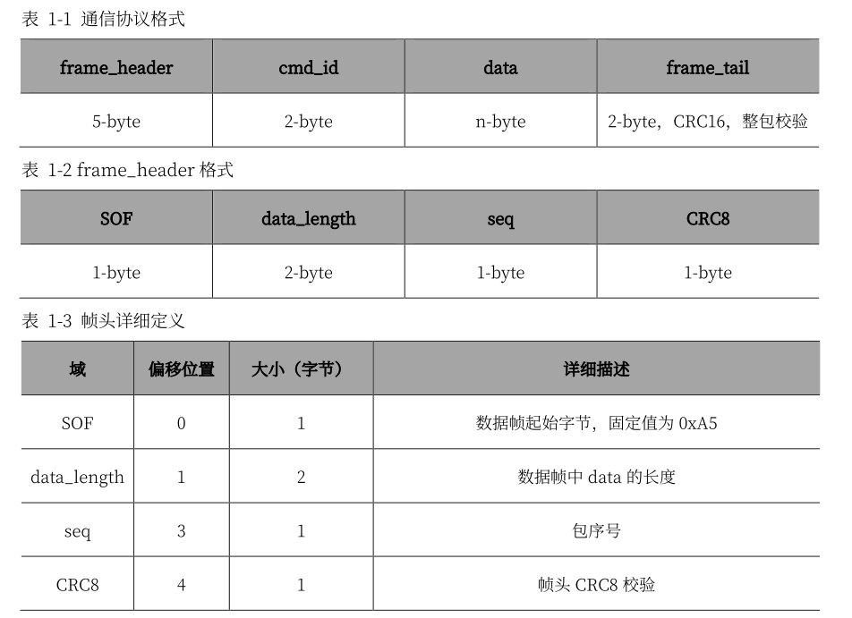
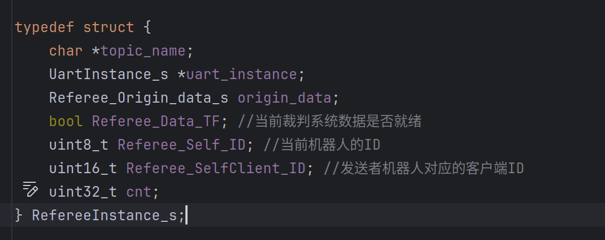

## 串口协议(一些配置要求)

######  通信方式为串口，配置为:常规链路的波特率为115200,图传链路的波特率为921600(老图传是115200),数据位8位,停止位1位,无硬件流控,无流控.



-----------
### 文件定义:

``dev_referee.c   
dev_referee.h``  实现了基础裁判系统接收数据与一些获取数据的接口，如果不用绘制UI,直接#include "dev_referee.h"即可

--------

``dev_referee_protocol.h`` 裁判系统接收数据结构体定义头文件

-------
``dev_referee_ui.c
dev_referee_ui.h``   在referee_dev.h的基础上实现了UI绘制等逻辑作为升级模块，如果需要绘制UI,将#include "dev_referee.h"改为dev_referee_ui.h即可


-------
注: 裁判系统现在支持软件看门狗,可手动配置超时时间,超时回调,重置回调等,看门狗的Step需要在循环中用户手动进行   
裁判系统目前支持两种数据接受方式: IT与IDLE,配置成其他模式会返回错误   
中断模式下(解析等操作都在中断中处理)   
省流(最简版):
```cpp
#include "dev_referee.h"
#include "App_RefereeTask.h"
#include "bsp_log.h"
#include "cmsis_os.h"


RefereeInitConfig_s referee_config = {
    .topic_name = "referee",
    .uart_handle = &huart10,
    .mode = UART_IT_MODE,
};
RefereeInstance_s* ref_instance;


void App_RefereeTask(void const * argument)
{
     ref_instance = Referee_Register(&referee_config);
     if (ref_instance == NULL)
     {
         Log_Error("Referee Register Failed!");
     }
    while (1)
    {   
        Referee_Clear_Uart_Error(ref_instance);   //若有则清除uart错误
        osDelay(1);
    }

}
```

IDLE模式下:   
自动使用双缓冲区进行数据处理,理论上相对于IT模式有更优越的性能   
使用方式与IT一致,数据消费在空闲中断中处理(注:VT13遥控器数据只能通过该模式接收)   

```cpp
#include "dev_referee.h"
#include "App_RefereeTask.h"
#include <string.h>
#include "bsp_log.h"
#include "cmsis_os.h"


RefereeInitConfig_s referee_config = {
    .topic_name = "referee",
    .uart_handle = &huart10,
    .mode = UART_IDLE_MODE,
};
RefereeInstance_s* ref_instance;


void App_RefereeTask(void const * argument)
{
    ref_instance = Referee_Register(&referee_config);
    if (ref_instance == NULL)
    {
        Log_Error("Referee Register Failed!");
    }
    while (1)
    {   
        Referee_Clear_Uart_Error(ref_instance);   //若有则清除uart错误
        osDelay(1);
    }
}
```

### 数据结构讲解

RefereeInstance_s中 origin_data是一个包含所有可接收数据结构体的结构体，每一个解析通过的数据帧都会实时存储更新到这里，你可以在这里获取裁判系统数据的原始数据


Referee_Data_TF 表示了当前数据是否可用，默认为false,当第一次收到完整的数据帧时变为true。


Referee_Self_ID与Referee_SelfClient_ID保存了当前机器人ID与客户端ID(不会自动更新),当调用

```cpp 
#获取当前机器人ID 
uint8_t Referee_Get_Robot_ID(RefereeInstance_s *ref_instance);
```

```cpp 
#获取当前客户端ID
uint16_t Referee_Get_Client_ID(RefereeInstance_s *ref_instance);
```
这两个辅助函数会进行更新与返回

cnt记录了当前完整接收数据帧的个数

其他辅助函数详见dev_referee.h注释
关于UI绘制辅助函数详见dev_referee_ui.h注释


