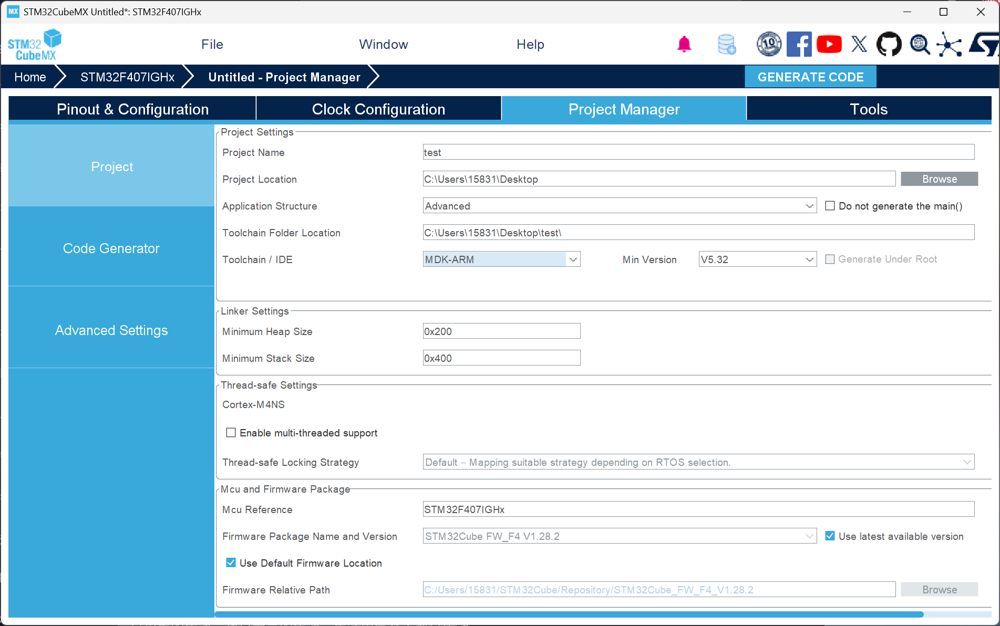
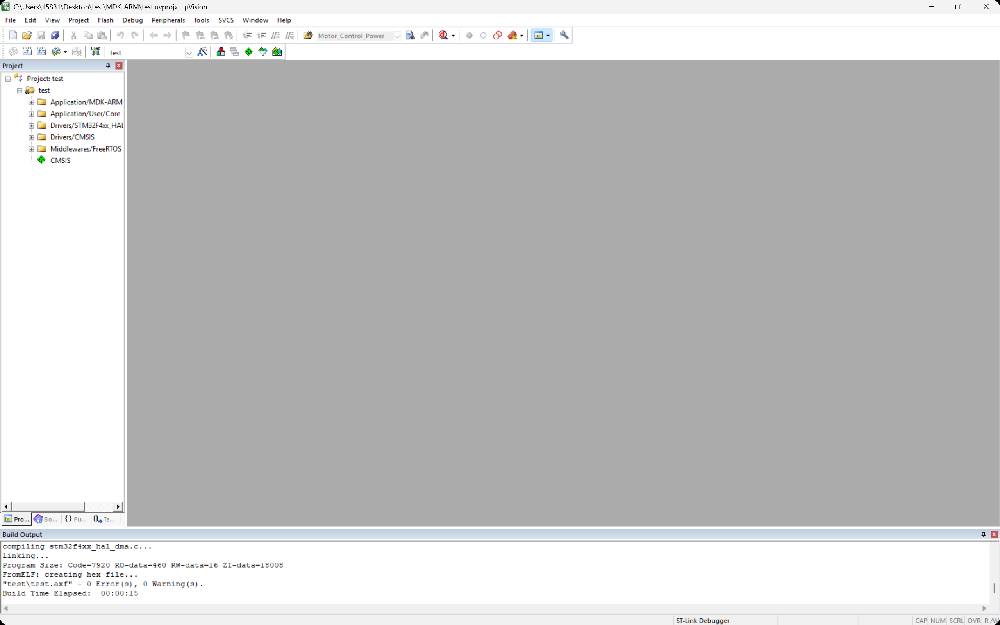
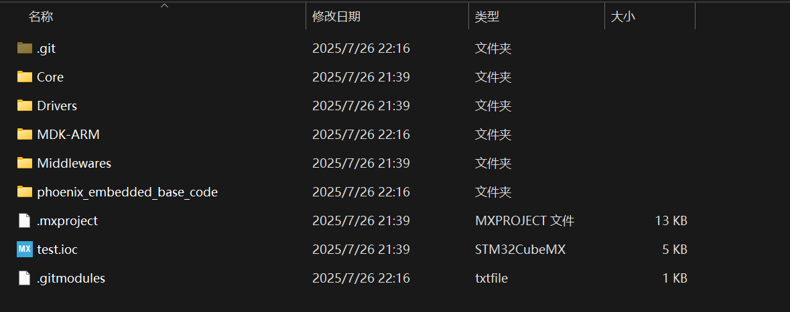

# PHOENIX 嵌入式基础代码库

<div align="center">


**基于 STM32 + FreeRTOS 的嵌入式开发框架**


</div>

## 📖 项目简介

PHOENIX 嵌入式基础代码库是一个专为 STM32 微控制器和 FreeRTOS 实时操作系统设计的嵌入式开发框架。本项目提供了丰富的底层驱动、算法模块和设备驱动，旨在帮助开发者快速构建稳定可靠的嵌入式应用。

### ✨ 主要特性

- 🚀 **模块化设计**：清晰的分层架构，便于维护和扩展
- 🔧 **丰富的驱动支持**：支持多种传感器、执行器和通信模块
- 🧮 **算法库集成**：内置 PID、卡尔曼滤波、Mahony 等常用算法
- 📡 **通信协议支持**：CAN、UART、SPI 等多种通信方式
- 🎮 **RoboMaster 适配**：针对 RoboMaster 竞赛优化
- 📚 **详细文档**：每个模块都有完整的使用说明 <font size="2"><del>大概罢（心虚）</del></font>

## 🏗️ 架构概览

```
phoenix_embedded_base_code/
├── Algorithm/          # 算法库
│   ├── Chassis_calc/   # 底盘运动学计算
│   ├── Crc/           # CRC 校验算法
│   ├── Kalman/        # 卡尔曼滤波器
│   ├── Mahony/        # Mahony 姿态解算
│   └── Pid/           # PID 控制算法
├── Bsp/               # 板级支持包
│   ├── Can/           # CAN 总线驱动
│   ├── Exti/          # 外部中断驱动
│   ├── Tim/           # 定时器驱动
│   └── Uart/          # 串口驱动
├── Module/            # 设备驱动模块
│   ├── Buzzer/        # 蜂鸣器模块
│   ├── Com_System/    # 通信系统
│   ├── Dr16/          # DR16 遥控器
│   ├── Ist8310/       # IST8310 磁力计
│   ├── LED/           # LED 驱动
│   ├── Motor/         # 电机驱动
│   │   ├── Dji/       # DJI 电机
│   │   ├── Dm/        # DM 电机
│   │   ├── Lk/        # LK 电机
│   │   └── Unitree/   # Unitree 电机
│   ├── Servo/         # 舵机驱动
│   └── usb/           # USB 模块
└── temp_informality_InsTask/  # IMU 任务示例
```


### 环境要求

- **硬件平台**：STM32F4 系列（推荐 RoboMaster C 板）
- **开发工具**：
  - STM32CubeMX
  - Keil MDK-ARM 5
- **系统要求**：FreeRTOS


## 📦 核心模块

### 🧮 算法库 ([Algorithm](Algorithm/))

- **PID 控制器**：支持位置式PID
- **卡尔曼滤波器**：用于数据融合和状态估计
- **Mahony 算法**：IMU 姿态解算
- **CRC 校验**：数据完整性验证
- **底盘运动学**：多种底盘类型运动学解算

### 🔌 底层驱动 ([Bsp](Bsp/))

- **CAN 总线**：支持标准帧和扩展帧
- **UART 串口**：支持 DMA 收发
- **定时器**：PWM 输出、编码器读取
- **外部中断**：GPIO 中断处理

### 🎛️ 设备模块 ([Module](Module/))

- **电机驱动**：支持 DJI、DM、LK、Unitree 等品牌电机
- **传感器**：IST8310 磁力计、BMI088 IMU
- **通信设备**：DR16 遥控器接收
- **执行器**：舵机、蜂鸣器、LED
- **USB 通信**：CDC 虚拟串口
- **通信系统**：数据交互

## 📚 文档说明

- **[开发指南](development_guide.md)**：详细的开发流程和规范
- **模块文档**：每个模块目录下都有对应的 README 或 markdown 文档 <font size="1">（补完中）</font>

## 🤖 使用指南
该指南以keil5开发为例，如果使用clion或其他开发环境，请根据实际情况进行调整即可 
1. 使用cubemx配置并生成代码(keil5选择`MDK-ARM`)，注意要开启`FreeRTOS`才能使用本仓库。

   

   编译一次提示无错误无警告则工程创建完成

   

2. 把本地仓库推送到GitHub，这一步过于简单，不再多说
3. 拉取本仓库作为子模块加入(个人推荐的一种方式)
  ```bash
  git submodule add git@github.com:HDU-PHOENIX/phoenix_embedded_base_code.git [目标路径] # 如果目标路径为空，默认使用仓库名作为目录名。
  ```
  此时在目标路径下会生成一个名为`phoenix_embedded_base_code`的目录，里面包含了本仓库的所有内容。(如果填了目标路径则会使用目标路径作为目录名)
  
  如图所示，到此步应该在工程目录下会有`.git`,`.gitmodules`和`phoenix_embedded_base_code`三个文件夹，`.git`和`.gitmodules`是Git的配置文件，`phoenix_embedded_base_code`是本仓库的内容。  

4. 在使用本仓库前，需要用户自己创建一个名为 `robot_config.h`的文件，其中需要存放一些关于库的设置信息，具体可复制下文按自己的工程进行修改：
```C
#ifndef __ROBOT_CONFIG_H__
#define __ROBOT_CONFIG_H__

/* 是否使用FreeRTOS */
#define USE_FREERTOS

/* 是否启用Log */
#define USER_LOG

/* CAN 类型 */
#define USER_CAN_STANDARD                   // 使用 标准 CAN
// #define USER_CAN_FD                      // 使用 CAN FD

/*CAN 过滤器模式选择*/
#define USER_CAN_FILTER_MASK_MODE           // 使用掩码模式
// #define USER_CAN_FILTER_LIST_MODE        // 使用列表模式

/* CAN 总线启用 */
#define USER_CAN1                           // 使用 CAN1
#define USER_CAN2                           // 使用 CAN2
// #define USER_CAN3                        // 使用 CAN3
            
/* CAN FIFO 选择 */         
#define USER_CAN1_FIFO_0                    // 使用 CAN1 FIFO0
// #define USER_CAN1_FIFO_1                 // 使用 CAN1 FIFO1
// #define USER_CAN2_FIFO_0                 // 使用 CAN2 FIFO0
#define USER_CAN2_FIFO_1                    // 使用 CAN2 FIFO1
// #define USER_CAN3_FIFO_0                 // 使用 CAN3 FIFO0
// #define USER_CAN3_FIFO_1                 // 使用 CAN3 FIFO1

#ifdef USE_FREERTOS
#include "FreeRTOS.h"
#define user_malloc pvPortMalloc
#define user_free vPortFree
#else
#include "stdlib.h"
#define user_malloc malloc
#define user_free free
#endif
#endif /* __ROBOT_CONFIG_H__ */
```
   当然也可以使用仓库中提供的html文件进行配置，但是由于目前队里没人会熟练使用html，故可能会存在一些bug，请仔细检查该文件，不然会影响后续一切库里代码的编译以及运行

5. 此时文件就放到工程目录下了，也做好了相关配置工作，接下来按正常工程的操作添加路径即可使用，具体使用方法参考各模块文档   

6. 添加自己编写的内容
    为了防止自己的代码和仓库代码混淆,此时需要新建一个名为`User_File`的目录存放自己的代码。由于本仓库中封装好了Bsp层和Module层，故正常情况下在`User_File`目录下只需要添加`User_Application`目录即可（或者直接把`User_File`目录直接替换为`User_Application`），存放自己的应用代码，如果您需要使用仓库中没有的模块或算法，可以自行添加`User_Module`等目录存放自己的模块代码。**不过这里强烈建议你把本仓库中没有涉及的模块或算法按照编写要求修改后，以PR形式提交到本仓库中，我们十分期待您的贡献**  
7. 代码编写完成后，在项目文件夹下推送到远端仓库，由于`gitmodule`的特性，您的推送不会对仓库代码造成影响，您可以放心使用。
8. 拉取最新仓库代码，如果有更新，使用以下命令拉取最新代码
   ```bash
   git submodule update --remote
   ```
   这条命令会拉取最新的仓库代码到本地仓库中，注意要进行一次`push`操作才能将最新代码推送到远端仓库中。

### 不想使用gitmodule？
1. 工程使用git: 单独拉取本仓库，然后把内容复制粘贴到自己的工程，其余同上。不粘贴能用，就工程路径会很奇怪，一个工程被分成了两个文件夹
2. 工程未使用git: 直接在仓库目录下拉取本仓库 
总结：还是推荐使用gitmodule的方式，毕竟这样可以更好地管理代码版本和更新。


## 👀 使用须知
- 在使用本仓库的代码时，请不要自行添加或修改任何内容，遇到bug或有更好的实现方式，请以PR或lssues的形式提交到本仓库中，我们会尽快处理。
- 在编译包含本仓库代码的工程时，请确保你已按照各使用的模块的文档要求正确配置，并且请确定使用模块的路径被正确添加到工程中
- 请避免在`User_File`中命名与本仓库中相同名字的文件
- 遇到无法解决的问题，可以直接联系仓库管理员邮箱(hewenxuan923@gmail.com)或(2956889047@qq.com)

## 🤝 贡献指南

我们欢迎并鼓励贡献！参与方式：

1. **Fork** 本仓库
2. 创建特性分支：`git checkout -b feature/your-feature`
3. 提交更改：`git commit -m 'feat: add some feature'`
4. 推送分支：`git push origin feature/your-feature`
5. 提交 **Pull Request**

### 分支命名规范

| 前缀 | 用途 | 示例 |
|------|------|------|
| `feature/` | 新功能 | `feature/can-driver` |
| `fix/` | Bug 修复 | `fix/pid-calculation` |
| `hotfix/` | 紧急修复 | `hotfix/motor-error` |
| `docs/` | 文档更新 | `docs/readme-update` |

### Commit 信息规范
遵循 [Conventional Commits](https://www.conventionalcommits.org/) 规范：

- `feat`: 新功能
- `fix`: Bug 修复
- `docs`: 文档更新
- `style`: 代码风格调整
- `refactor`: 代码重构
- `test`: 测试相关
- `chore`: 构建过程或辅助工具的变动

## 🐛 问题反馈

遇到问题？请通过以下方式反馈：

1. **GitHub Issues**：提交 bug 报告或功能请求
2. **Pull Request**：直接提交代码修复

## 🙏 致谢

感谢所有为本项目做出贡献的开发者！

## 📞 联系我们

- **组织**：HDU-PHOENIX
- **GitHub**：[https://github.com/HDU-PHOENIX](https://github.com/HDU-PHOENIX)
- **管理员邮箱**:<hewenxuan040923@gamil.com>
- 
---

<div align="center">

**如果这个项目对你有帮助，请给我们一个 ⭐ Star！**

</div>
